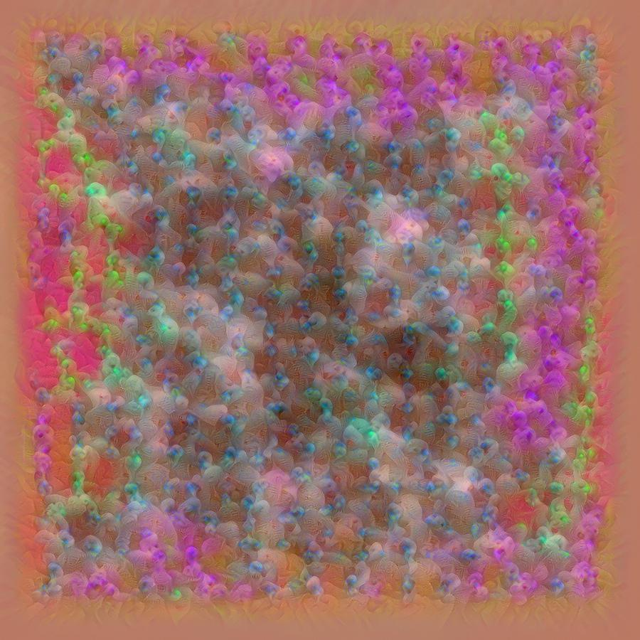

# Images of Image Machines. Visual Interpretability in Digital Art History

This repository contains all the code necessary to reproduce the results in the paper "Images of Image Machines. Visual Interpretability in Digital Art History", forthcoming in the Proceedings of the 2018 European Conference on Computer Vision. It also provides extended commentary on the details of the technical implementation, and options to use the code for the easy exploration of other machine learning models (REST API, HTML interface).

## Abstract

Despite the emergence of interpretable machine learning as a distinct area of research, the role and possible uses of interpretability in digital art history are still unclear. Focusing on feature visualization as the most common technical manifestation of visual interpretability, we argue that in digital art history interpretability is desirable, if not indispensable. We propose that feature visualization images can be a useful tool if they are used in a non-traditional way that embraces their peculiar representational status. Moreover, we suggest that exactly because of this peculiar representational status, feature visualization images themselves deserve more attention from the computer vision and digital art history communities.

*Semantically interesting feature visualization for layer mixed5/neuron 66 of an InceptionV3 model trained on ImageNet. A large number of feature visualization images for the model discussed in the paper can be found in the [images](images) directory.*

## Features

- Downloader for the Web Gallery of Art dataset
- Complete workflow to train and evaluate a model on a user-defined subset of this dataset
- Fast (threaded) feature visualization implementation for multiple architectures (currently InceptionV3 and VGG16) and all pre-trained Keras Models
- Minimal but effective regularization
- Feature visualization REST API
- Sample HTML interface using this API

*The essence of a portrait, according to InceptionV3.*

## Installation

This repository officially only supports Unix-based operating systems but most likely runs on Windows as well, given a proper Python environment (untested).

### Manual installation using pip or conda

We suggest running the notebooks within an [Anaconda](https://www.anaconda.com/download) or [Miniconda](https://conda.io/miniconda.html) envrionment. The notebooks in the repository have only Python dependencies, all of which can be installed with `pip` or `conda`. To install all dependencies with conda in a Miniconda environment, run

`conda install gevent Pillow`

`pip install tensorflow-gpu keras jupyter_kernel_gateway tqdm`.

Replace `tensorflow-gpu` with `tensorflow` for a CPU only installation. 

Finally, clone this repository and run a `jupyter notebook` server in the repository directory.

### Installation using [Docker](https://www.docker.com/)

Clone this repository. Open [run_CPU.sh](docker/run_CPU.sh) or [run_GPU.sh](docker/run_GPU.sh) in a plain text editor of your choice and replace `YOUR PASSWORD HERE` with a password of your choice. Run either [run_GPU.sh](docker/run_GPU.sh) or [run_CPU.sh](docker/run_CPU.sh) for an environment with or without NVIDIA GPU support. NVIDIA support with Docker currently only works under Linux.

## Main repository contents

- [wga.ipynb](wga.ipynb): Download the dataset
- [train.ipynb](train.ipynb): Fine-tune an InceptionV3 model on a subset of the dataset
- [test.ipynb](test.ipynb): Evaluate the model
- [explain.ipynb](explain.ipynb): Generate feature visualizations (standalone/API)
- [interface.html](interface.html): Sample HTML interface for explain.ipynb REST API
- [images](images): Directory containing a large number of feature visualization images for the model discussed in the paper.

## Interface

The repository comes with an example [HTML interface](interface.html). When the [explain.ipynb](explain.ipynb) notebook is running in API mode (see notebook for details), the interface can be used to explore the feature visualization space for a model by generating feature visualization images for different layers, neurons, and in different resolutions. The visualization thread gives priority to high-resolution images, so if an interesting neuron is found, high resolution feature visualizations can be generated immediately. Interesting images can simply be saved by right clicking.

